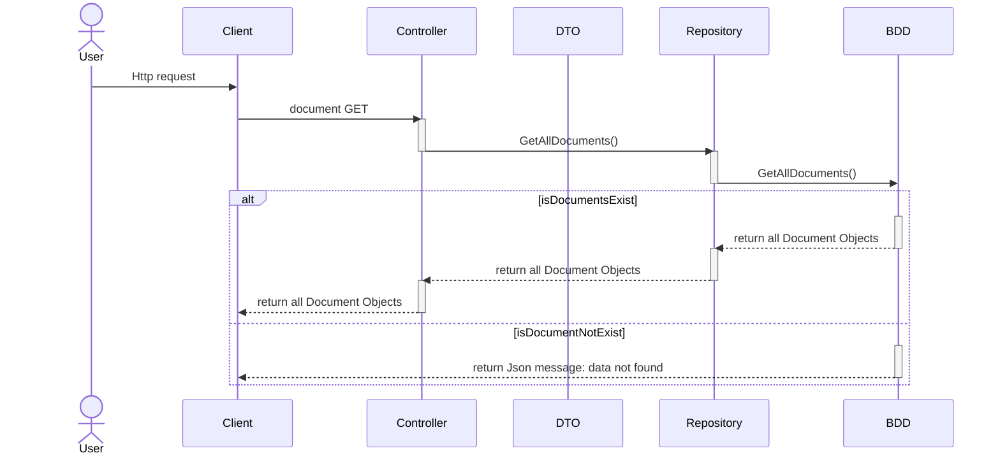

```mermaid
sequenceDiagram
    actor User
    participant Cl as Client    
    participant Ctrl as Controller
    participant D as DTO
    participant R as Repository
    participant B as BDD
    

User->>Cl:Http request
Cl->>Ctrl: document GET

activate Ctrl
Ctrl->>R: GetAllDocuments()
deactivate Ctrl
activate R
R->>B: GetAllDocuments()
deactivate R
    alt isDocumentsExist
        activate B
        B-->>R: return  all Document Objects
        deactivate B
        activate R
        R-->>Ctrl: return all Document Objects
        deactivate R
        activate Ctrl
        Ctrl-->>Cl: return all Document Objects
        deactivate Ctrl

    else isDocumentNotExist
        activate B
        B-->>Cl: return Json message: data not found
        deactivate B
        end
   


```