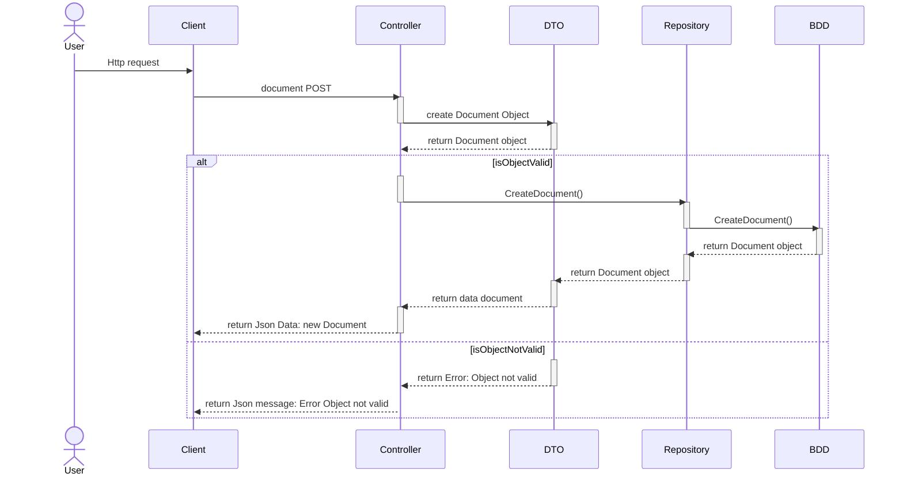

```mermaid
sequenceDiagram
    actor User
    participant Cl as Client    
    participant Ctrl as Controller
    participant D as DTO
    participant R as Repository
    participant B as BDD
    

User->>Cl:Http request;
Cl->>Ctrl: document POST;


activate Ctrl
Ctrl->>D: create Document Object;
deactivate Ctrl
activate D
D-->> Ctrl: return Document object
deactivate D

alt isObjectValid
    activate Ctrl
    Ctrl->>R: CreateDocument()
    deactivate Ctrl

    activate R
    R->>B: CreateDocument()
    deactivate R
    activate B
    B-->>R: return Document object
    deactivate B
    activate R
    R-->>D: return Document object
    deactivate R
    activate D
    D-->>Ctrl: return data document
    deactivate D
    activate Ctrl
    Ctrl-->>Cl: return Json Data: new Document
    deactivate Ctrl

    else isObjectNotValid

            activate D
            D-->>Ctrl: return Error: Object not valid
            deactivate D
            activate Ctrl
            Ctrl-->>Cl: return Json message: Error Object not valid 
                        
       
    end


```