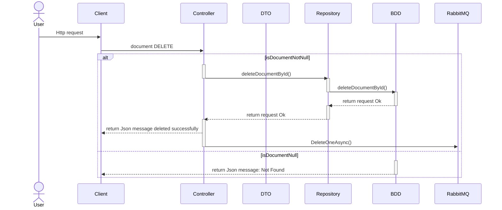

```mermaid
sequenceDiagram
    actor User
    participant Cl as Client    
    participant Ctrl as Controller
    participant D as DTO
    participant R as Repository
    participant B as BDD
    participant MQ as RabbitMQ
    

User->>Cl:Http request;
Cl->>Ctrl: document DELETE;

    
alt isDocumentNotNull    
    activate Ctrl
    Ctrl->>R: deleteDocumentById()
    deactivate Ctrl
    activate R
    R->>B: deleteDocumentById()
    deactivate R

    activate B
    B-->>R: return request Ok
    deactivate B
    activate R
    R-->>Ctrl: return request Ok
    deactivate R
    activate Ctrl
    Ctrl-->>Cl: return Json message deleted successfully
    Ctrl->>MQ: DeleteOneAsync()
    deactivate Ctrl

    else isDocumentNull

    activate B
    B-->>Cl: return Json message: Not Found
    deactivate B

    end

```