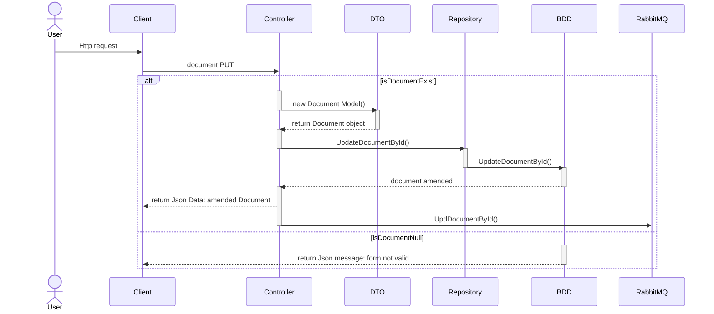

```mermaid
sequenceDiagram
    actor User
    participant Cl as Client    
    participant Ctrl as Controller
    participant D as DTO
    participant R as Repository
    participant B as BDD
    participant MQ as RabbitMQ
    

User->>Cl:Http request;
Cl->>Ctrl: document PUT;

alt isDocumentExist
    activate Ctrl
    Ctrl->>D: new Document Model();
    deactivate Ctrl
    activate D
    D-->> Ctrl: return Document object
    deactivate D
    activate Ctrl
    Ctrl->>R: UpdateDocumentById()
    deactivate Ctrl
    activate R
    R->>B: UpdateDocumentById()
    deactivate R
    activate B
    B-->>Ctrl:document amended
    deactivate B

    activate Ctrl
    Ctrl-->>Cl: return Json Data: amended Document
    Ctrl->>MQ: UpdDocumentById()
    deactivate Ctrl

    else isDocumentNull

    activate B
    B-->>Cl: return Json message: form not valid
    deactivate B

end
```