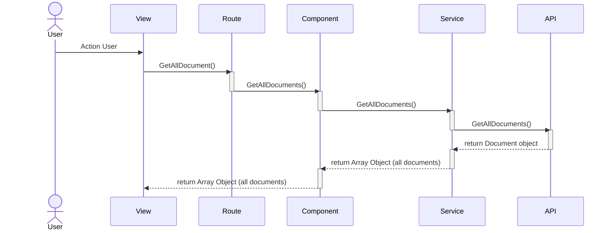

```mermaid
sequenceDiagram

    actor User 
    participant V as View    
    participant R as Route
    participant C as Component
    participant S as Service
    participant A as API
    

User->>V:Action User;
V->>R: GetAllDocument();

activate R
R->>C: GetAllDocuments()
deactivate R

activate C
C->>S: GetAllDocuments()
deactivate C
activate S
S->>A: GetAllDocuments()
deactivate S
activate A
A-->>S: return Document object
deactivate A
activate S
S-->>C: return Array Object (all documents)
deactivate S
activate C
C-->>V: return Array Object (all documents)
deactivate C 


```