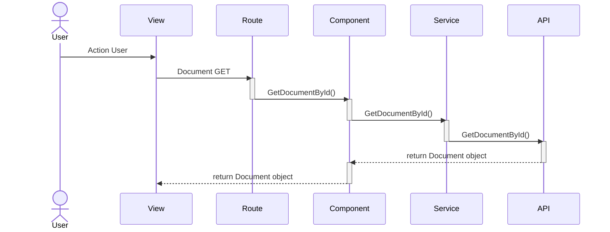

```mermaid
sequenceDiagram

    actor User 
    participant V as View    
    participant R as Route
    participant C as Component
    participant S as Service
    participant A as API
    

User->>V:Action User;
V->>R: Document GET;

activate R
R->>C: GetDocumentById()
deactivate R

activate C
C->>S: GetDocumentById()
deactivate C
activate S
S->>A: GetDocumentById()
deactivate S
activate A
A-->>C: return Document object
deactivate A
activate C
C-->>V: return Document object
deactivate C 


```