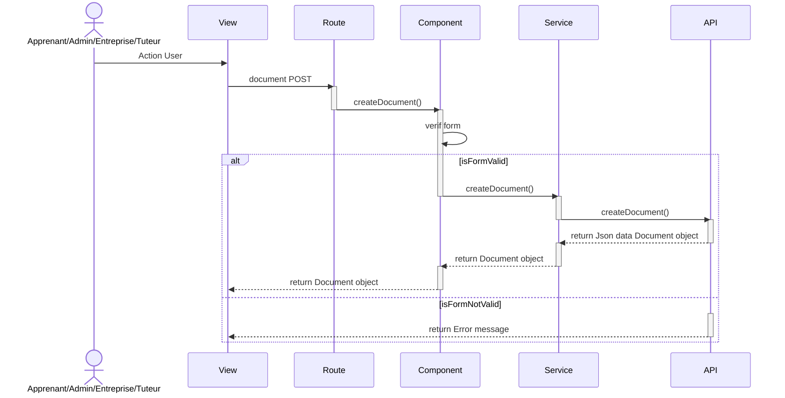

```mermaid
sequenceDiagram

    actor User as Apprenant/Admin/Entreprise/Tuteur
    participant V as View    
    participant R as Route
    participant C as Component
    participant S as Service
    participant A as API
    

User->>V:Action User;
V->>R: document POST;

    
        activate R
        R->>C: createDocument()
        deactivate R
        activate C
        C->>C: verif form
    alt isFormValid
        C->>S: createDocument()        
        deactivate C
        activate S
        S->>A: createDocument()
        deactivate S
        activate A
        A-->>S: return  Json data Document object
        deactivate A
        activate S
        S-->>C: return Document object
        deactivate S
        activate C
        C-->>V: return Document object
        deactivate C

    else isFormNotValid
        activate A
        A-->>V: return Error message
        deactivate A

    end

```