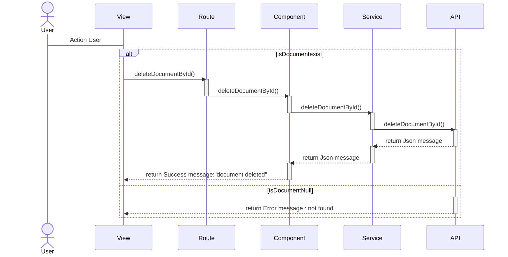

```mermaid
sequenceDiagram

    actor User 
    participant V as View    
    participant R as Route
    participant C as Component
    participant S as Service
    participant A as API


User->V: Action User

alt isDocumentexist
    V->>R: deleteDocumentById()
    activate R
    R->>C: deleteDocumentById()
    deactivate R
    activate C
    C->>S: deleteDocumentById()
    deactivate C
    activate S
    S->>A: deleteDocumentById()
    deactivate S
    activate A
    A-->>S: return Json message
    deactivate A
    activate S
    S-->>C: return Json message
    deactivate S
    activate C
    C-->>V: return Success message:"document deleted"
    deactivate C

else isDocumentNull
    activate A
    A-->>V: return Error message : not found
    deactivate A
    
end

```