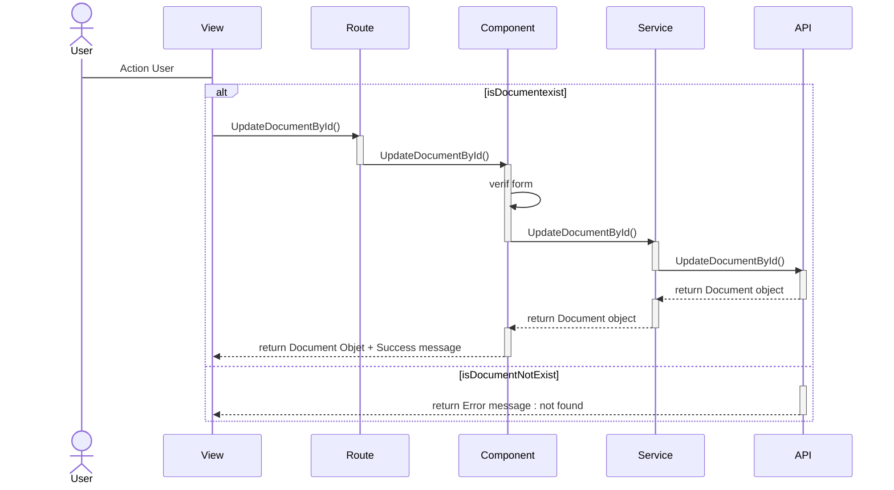

```mermaid
sequenceDiagram

    actor User 
    participant V as View    
    participant R as Route
    participant C as Component
    participant S as Service
    participant A as API


User->V: Action User

alt isDocumentexist
    V->>R: UpdateDocumentById()
    activate R
    R->>C: UpdateDocumentById()
    deactivate R
    activate C
    C->>C: verif form
    C->>S: UpdateDocumentById()
    deactivate C
    activate S
    S->>A: UpdateDocumentById()
    deactivate S
    activate A
    A-->>S: return Document object
    deactivate A
    activate S
    S-->>C: return Document object
    deactivate S
    activate C
    C-->>V: return Document Objet  + Success message
    deactivate C

else isDocumentNotExist
    activate A
    A-->>V: return Error message : not found
    deactivate A
    
end

```